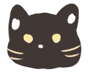

#  Mewfit

**Mewfit** is a cat-themed fitness app that gamifies your workouts. Stay active, achieve your fitness goals, and keep your virtual cat happy! Perfect for cat lovers and fitness enthusiasts alike.

---

##  Project Overview
Mewfit combines the love for fitness and cats into a unique and engaging app. By completing real-world workouts, users can take care of their virtual feline companions, encouraging consistent activity and healthier lifestyles. 

The app is designed to address common fitness challenges such as maintaining motivation and setting achievable goals. Mewfit incorporates a gamified system where progress is rewarded with the growth and happiness of a virtual cat, creating a positive feedback loop that keeps users coming back.

With Mewfit, users can:
- Monitor their fitness journey through visual progress tracking.
- Customize workout goals to match their personal fitness levels.
- Participate in fun challenges that make exercise enjoyable.
- Stay connected to their fitness routines through engaging, cat-themed visuals.

Whether you are a fitness beginner or a seasoned athlete, Mewfit offers a supportive and lighthearted environment to achieve your health goals while indulging your love for cats. By turning workouts into an interactive experience, Mewfit transforms exercise from a chore into a daily highlight.

---

##  Features
- **Gamified Fitness**: Turn your workouts into fun challenges.
- **Virtual Cat Companion**: Care for a virtual cat that grows with your progress.
- **Activity Tracking**: Log exercises and monitor your achievements.
- **Custom Goals**: Set personalized fitness objectives.
- **Engaging Interface**: Cute, cat-themed designs to keep you motivated.
- **MEWTRACK Pose Detection**: Used MoveNet for real-time pose tracking.
- **MEWAI Chatbot and Algorithm**: Used Gemini 1.5 for AI Chatbot Assistance and the Algorithm for some recommand.

---

## MEWTRACK and MEWAI
###  MEWTRACK (Pose Detection System)
Mewfit integrates MEWTRACK, a high-performance pose detection model, to track users' movements in real-time. MEWTRACK is optimized for speed and accuracy, making it suitable for fitness applications. It can recognize key points of the body and provide feedback on exercise posture, helping users maintain proper form and reduce the risk of injury.

While MEWTRACK is highly effective, it is not perfect and may occasionally misinterpret certain movements, particularly in low-light conditions or when the camera angle is suboptimal. Users should use the detected poses as guidance rather than definitive evaluations.

##  Warning
Please note that the pose detection feature in Mewfit relies on advanced algorithms, which may not always provide highly accurate results. The detected poses should be used as a reference to guide your workouts rather than as a definitive assessment of your movements.
##

###  MEWAI (Aritifical Intelligence System)
Mewfit features MEWAI, an interactive AI chatbot powered by Gemini 1.5, designed to enhance your fitness experience. This friendly feline assistant provides:
- Personalized workout suggestions tailored to your fitness level and progress
- Answers to your fitness and nutrition questions in a fun, cat-themed conversation
- Motivational messages to keep you engaged with your fitness routine

##  Warning
To access the MEWAI chatbot functionality, you'll need to add your Google Gemini API key in the app settings. Without this key, the chatbot features will not be available.
##

---

##  Installation
1. Clone the repository:
   ```bash
   git clone https://github.com/Wilsomwong2004/mewfit.git
   ```
2. Navigate to the project directory and copy it to the `htdocs` folder of your XAMPP installation:
   ```bash
   cd mewfit
   cp -r . /path/to/xampp/htdocs/mewfit
   ```
3. Start XAMPP and activate the **Apache** and **MySQL** services.
4. Open your browser and navigate to `http://localhost/phpmyadmin`.
5. Import the provided database file:
   - Click on "Import" in phpMyAdmin.
   - Select the SQL file included in the project.
   - Click "Go" to complete the import.
6. Open the app in your browser:
   ```
   http://localhost/mewfit
   ```
---

##  Usage
1. Create an account or log in.
2. Set your fitness goals.
3. Start tracking your workouts and activities.
4. Watch your virtual cat grow as you progress!

##  Technologies Used
- **Frontend**: PHP, CSS, JavaScript
- **Backend**: PHP
- **Database**: MySQL
- **Others**: Chart.js, MoveNet API, Gemini 1.5 API, Responsive Voice API


##  Contributing
We welcome contributions! To contribute:
1. Fork the repository.
2. Create a new branch:
   ```bash
   git checkout -b feature-name
   ```
3. Make your changes and commit them:
   ```bash
   git commit -m "Add feature-name"
   ```
4. Push to your forked repository:
   ```bash
   git push origin feature-name
   ```
5. Submit a pull request.

---

##  Reference
This project workout video all used from Youtube Channel called Exercise Library Jonna Soh.
Youtube Channel link: https://www.youtube.com/@ExerciseLibraryJoannaSoh/videos

---

##  License
This project is licensed under the MIT License. See the LICENSE link below for details.

[](https://opensource.org/licenses/Apache-2.0)
[](https://opensource.org/licenses/MIT)

---

##  Contact
For questions or support, feel free to reach out:
- **Email**: [mewfitoffical@gmail.com](mailto:mewfitoffical@gmail.com)
- **GitHub**: Issue the project on github

